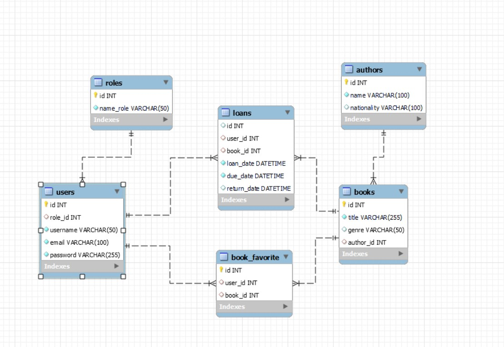
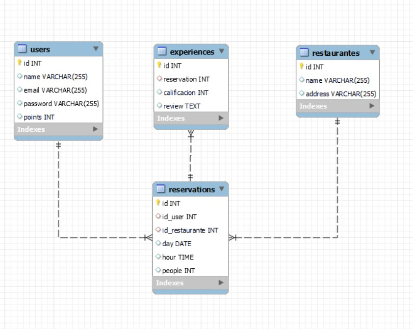

### Retos MySQL 

##### RETO 0
Establece las relaciones correspondientes en nuestro diseño de la librería online.

 </img>

##### RETO 2

Diseña un sistema para gestionar reservas en restaurantes. Los usuarios pueden buscar
restaurantes, hacer reservas para ciertas fechas y horas, dejar reseñas sobre sus
experiencias y acumular puntos de fidelidad. ¿Cuáles serían las entidades clave?

 </img>